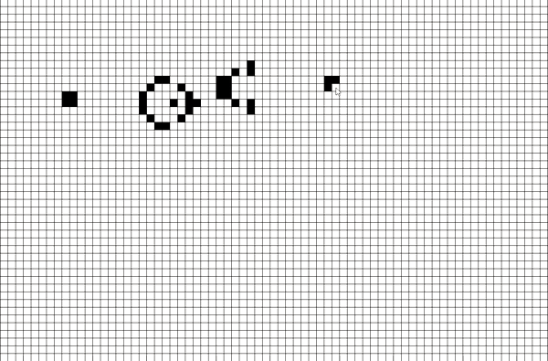

# 2D Cellular Automata - Game Of Life

> _These descriptions are copied from wikipedia._

## Cellular Automaton

A cellular automaton consists of a regular grid of cells, each in one of a finite number of states, such as on and off. The grid can be in any finite number of dimensions. For each cell, a set of cells called its neighborhood is defined relative to the specified cell. An initial state is selected by assigning a state for each cell. A new generation is created, according to some fixed rule (generally, a mathematical function) that determines the new state of each cell in terms of the current state of the cell and the states of the cells in its neighborhood.

 

## Conwoy's Game of Life

The Game of Life, also known simply as Life, is a cellular automaton devised by the British mathematician John Horton Conway in 1970. It is a zero-player game, meaning that its evolution is determined by its initial state, requiring no further input. One interacts with the Game of Life by creating an initial configuration and observing how it evolves. It is Turing Complete and can simulate a universal constructor or any other Turing machine.

> _We check each cell's moore neighbourhood, which is nothing but the cell and 8 cells that surround it._

 

### Rules in GoL

* **Death State**

    1. Underpopulation: Any live cell with fewer than two live neighbours dies.
    2. Overpopulation: Any live cell with more than three live neighbours dies.

 

* **Alive State**
    1. Sustainence/Stability: Any live cell with two or three live neighbours lives on to the next generation.
    2. Birth: Any dead cell with exactly three live neighbours becomes a live cell.

## Preview

**Gosper's Glider Gun**
 

 

**Random Gerneration**
 

